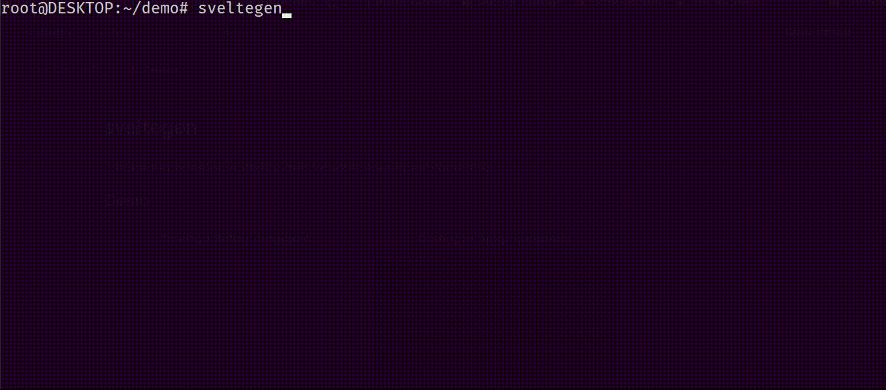

# sveltegen
A simple, easy to use CLI for creating Svelte/SvelteKit components, actions, and routes, quickly and conveniently.

[npm](https://www.npmjs.com/package/sveltegen)
## Demo
|  |
|:--:|
|<em>Creating a 'Navbar' component</em>|

## Usage
Note: only run Sveltegen at your project root directory.

```npm install -g sveltegen``` (recommended)

or

```npx sveltegen```
## File Output
Components:
```
[name].svelte
index.ts       // or index.js if not using Typescript
index.scss     // or index.css if not using SCSS
```
Routes:
```
[name]/index.svelte    // optional
[name]/index.json.ts   // optional ; or index.json.js if not using Typescript
```
Actions:
```
[name].ts     // or [name].js if not using Typescript
```

## Commands
| command | description |
|-- |--  |
| ```config``` | allows you to change the path to your output folders |
| ```help```   | shows all available commands |
